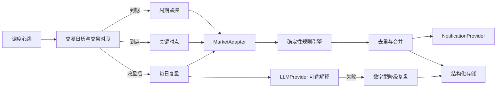

# 架构说明

## 一句话

一个高频“心跳”只负责判断哪些任务到期；行情、交易日历、规则、复盘和通知都通过可替换接口接入，页面不认识任何供应商原始字段。

## 核心边界

- `MarketAdapter`：交易日历、代码表、板块映射、快照、指数、涨跌停价、收盘数据与健康状态。
- `TradingCalendar` / `MarketSessionService`：所有时间固定使用 `Asia/Shanghai`。
- `RuleEngine`：所有数值、阈值与等级由代码计算；模型只写少量解释。
- `NotificationProvider`：浏览器本机通知、Server酱、邮件均使用同一结果契约；未配置的渠道只返回“待配置”，不会伪造发送成功。
- 真实数据硬约束：股票数据、预警和复盘只能引用带来源、数据时间和数据版本的真实响应；字段缺失时停止对应规则。
- `LLMProvider`：OpenAI-compatible 主/备提供方；超时、重试、熔断和每日费用上限由服务端配置。
- `JobLease` + 幂等键：避免同一任务并发或重复成功推送。
- `HistoricalReviewCache`：按用户、交易日期和当前关注股票集合缓存真实历史复盘；关注股票变化后会使用新的缓存键，不会误用旧范围。
- `TodayBrief`：市场、本人关注行业、本人关注股票三层独立读取和降级；只从关注范围选重点，任何一层失败都返回该层“没有数据”，不使用热门对象或固定行情补位。

## 首页可信摘要

- 市场层只在六个主要指数中选择绝对涨跌幅最大的一个，并明确比较基准为上一交易日收盘。`indices_only` 只展示指数价格事实，不生成全市场风险等级。
- 行业层只读取用户已确认的新浪行业代码与名称；概念板块当前没有稳定汇总时返回“没有数据”。来源未提供统一行情时间戳时，页面把时间标成“本次读取时间（行情新鲜度未知）”。
- 股票层只读取用户关注股票，按风险等级、绝对涨跌幅和“持有”优先顺序选择；盘中超过三分钟的快照标记过期。
- 首页当前只在页面打开和用户手动刷新时请求摘要。任务开关只保存计划，不能作为后台调度已经存活的证据。

## 历史复盘口径

- 行业分类只描述一组公司，不进入单股价格复盘。
- “开盘前”使用上一交易日的前复权收盘价作为可验证基准。
- “开盘后”使用当日 09:30 开盘价、收盘价、最高价、最低价和成交量。
- 没有稳定的 09:25 集合竞价或历史分钟数据时明确说明缺失，不由日线推测。

## 当前部署边界

当前 Sites 版本是可操作的私有验收环境，使用 D1 保存配置、任务记录、预警与复盘。生产心跳保留受密钥保护的 `/api/scheduler` 入口；CloudBase 定时触发器需要在用户确认平台后接入，不能把浏览器定时器当作可靠后台调度。

## 源码与发布边界

- GitHub `willwang2528/a-shares` 是主源码仓库，`origin/main` 是后续开发和追溯的基准。
- Sites 内部源码仅用于保存待部署的已验证提交，不在其上单独开发。
- 发布顺序固定为：同步 GitHub → 开发与测试 → 提交并推送 GitHub → 使用同一提交生成 Sites 部署版本。
