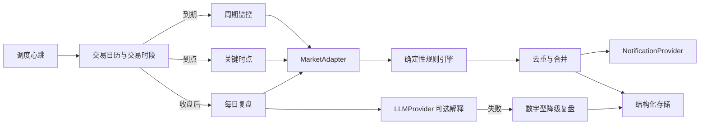

# 架构说明

## 一句话

一个高频“心跳”只负责判断哪些任务到期；行情、交易日历、规则、复盘和通知都通过可替换接口接入，页面不认识任何供应商原始字段。

## 核心边界

- `MarketAdapter`：交易日历、代码表、板块映射、快照、指数、涨跌停价、收盘数据与健康状态。
- `TradingCalendar` / `MarketSessionService`：所有时间固定使用 `Asia/Shanghai`。
- `RuleEngine`：所有数值、阈值与等级由代码计算；模型只写少量解释。
- `NotificationProvider`：模拟、浏览器本机通知、Server酱、邮件均使用同一结果契约。
- `LLMProvider`：OpenAI-compatible 主/备提供方；超时、重试、熔断和每日费用上限由服务端配置。
- `JobLease` + 幂等键：避免同一任务并发或重复成功推送。

## 当前部署边界

当前 Sites 版本是可操作的私有演示和验收环境，使用 D1 保存配置、任务记录、预警与复盘。生产心跳保留受密钥保护的 `/api/scheduler` 入口；CloudBase 定时触发器需要在用户确认平台后接入，不能把浏览器定时器当作可靠后台调度。
